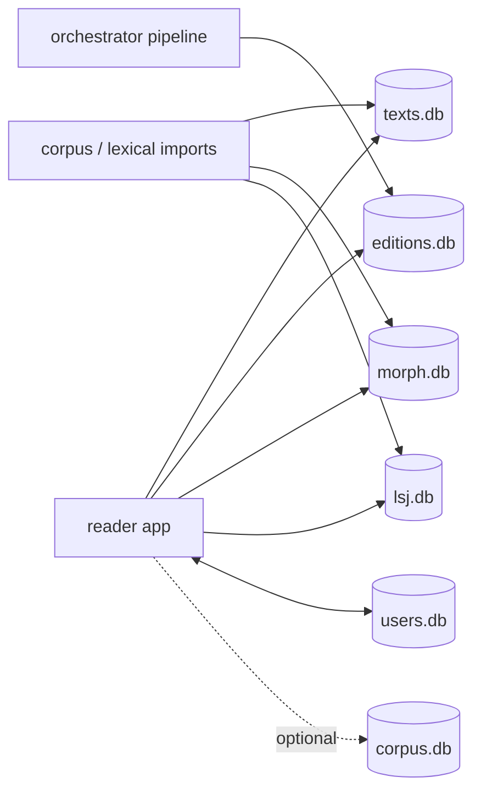

# Lyceum SQLite Database Documentation

This folder documents the SQLite databases used by the Lyceum reader, pipeline/orchestrator, and release artifacts.

The actual database files live mostly outside this `texts` repo, in sibling repos/directories such as `../reader/data/`, `../orchestrator/data/`, and `../release/`.

## Contents

- [Inventory](inventory.md) — database files, roles, mutability, and row counts.
- [Text-family schema](schemas/text-family.md) — shared `authors`/`works`/`editions`/`segments`/alignment tables used by `texts.db`, `corpus.db`, and `editions.db`.
- [texts.db](schemas/texts.md) — full reader library database.
- [corpus.db](schemas/corpus.md) — broad corpus/fallback database.
- [editions.db](schemas/editions.md) — curated Lyceum pipeline editions.
- [morph.db](schemas/morph.md) — morphology lookup database.
- [lsj.db](schemas/lsj.md) — dictionary database.
- [users.db](schemas/users.md) — local read-write learner state.
- [Regeneration and migration policy](regeneration-and-migrations.md).
- [Diagrams](diagrams/) — Mermaid source files.

## Visual overview

## Core rule

- Reference databases are generated/read-only at runtime.
- `users.db` is mutable local state and must be changed only through additive migrations.
