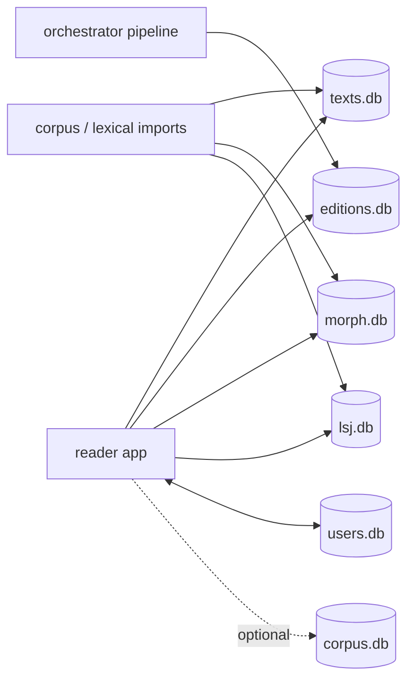

# Lyceum Database Documentation

This directory documents the SQLite databases used by the Lyceum reader, text-generation pipeline, and release workflow.

The large database files themselves mostly live outside this repository during development, in sibling directories such as `../reader/data/`, `../orchestrator/data/`, and `../release/`. Release copies are published as GitHub Release assets.

## What is documented here

- [`inventory.md`](inventory.md) — observed database files, paths, mutability, runtime roles, table lists, and row counts.
- [`schemas/text-family.md`](schemas/text-family.md) — shared `authors` / `works` / `editions` / `segments` / alignment schema used by `texts.db`, `corpus.db`, and `editions.db`.
- [`schemas/texts.md`](schemas/texts.md) — full reader library database.
- [`schemas/corpus.md`](schemas/corpus.md) — broad corpus and fallback text database.
- [`schemas/editions.md`](schemas/editions.md) — curated Lyceum edition database.
- [`schemas/morph.md`](schemas/morph.md) — morphology lookup database.
- [`schemas/lsj.md`](schemas/lsj.md) — LSJ dictionary database.
- [`schemas/users.md`](schemas/users.md) — local read-write learner state database.
- [`regeneration-and-migrations.md`](regeneration-and-migrations.md) — rules for rebuilding reference databases and migrating user data.
- [`diagrams/`](diagrams/) — Mermaid source diagrams.

## Database families

| Database | Mutability | Runtime role |
|---|---:|---|
| `texts.db` | read-only | Main reader library: authors, works, editions, segments, and alignments. |
| `corpus.db` | read-only / optional | Broad corpus source and fallback text database. |
| `editions.db` | read-only / optional | Curated Lyceum pipeline editions, interlinear alignments, contextual glosses, and source tracking. |
| `morph.db` | read-only | Greek morphology lookup data, currently derived from Perseus/Morpheus-style analyses. |
| `lsj.db` | read-only | Liddell-Scott-Jones dictionary definitions and short definitions. |
| `users.db` | read-write | Local learner state: vocabulary, SRS, reading progress, tags, and settings. |

## Visual overview

## Maintenance rules

- Treat `texts.db`, `corpus.db`, `editions.db`, `morph.db`, and `lsj.db` as generated read-only reference databases at runtime.
- Make schema and data changes in import/build scripts, then regenerate and publish new release artifacts.
- Treat release copies under `../release/` as artifacts, not schema sources.
- Treat `users.db` as live local learner state. Use additive migrations and back up `users.db`, `users.db-wal`, and `users.db-shm` before schema work.

See [`regeneration-and-migrations.md`](regeneration-and-migrations.md) for the full policy.
