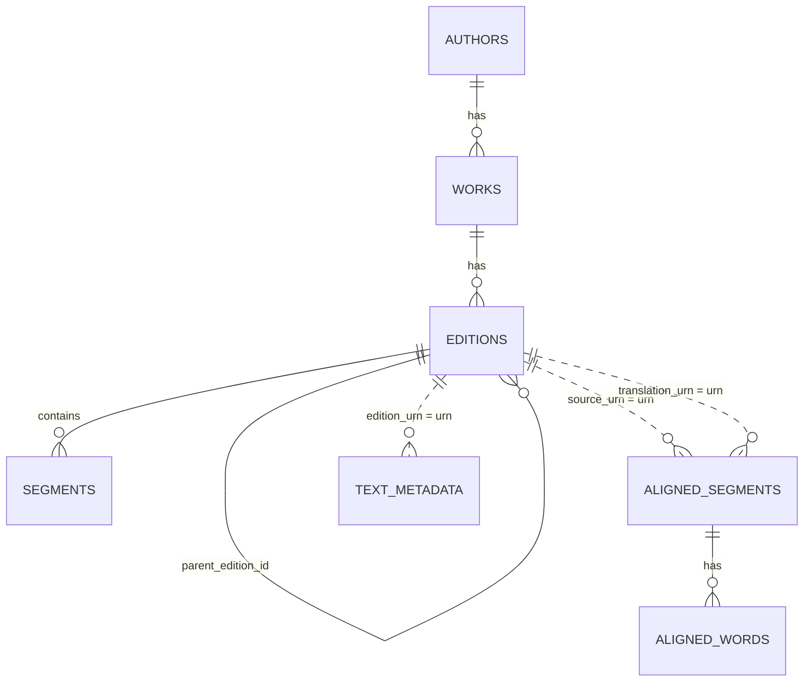

# Text-family Schema

Used by `texts.db`, `corpus.db`, and `editions.db` variants.

## Entity overview

## Tables

### `authors`

Authors represented by CTS-style URNs.

| Column | Type | Key | Notes |
|---|---|---|---|
| `id` | INTEGER | PK | Autoincrement surrogate key. |
| `urn` | TEXT | UNIQUE NOT NULL | Author URN. |
| `name` | TEXT | NOT NULL | Display name. |

### `works`

Works belonging to authors.

| Column | Type | Key | Notes |
|---|---|---|---|
| `id` | INTEGER | PK | Autoincrement surrogate key. |
| `author_id` | INTEGER | FK `authors.id` | Parent author. |
| `urn` | TEXT | UNIQUE NOT NULL | Work URN. |
| `title` | TEXT | NOT NULL | Display title. |
| `language` | TEXT |  | Work language. |

### `editions`

Text editions/translations belonging to works.

| Column | Type | Key | Notes |
|---|---|---|---|
| `id` | INTEGER | PK | Autoincrement surrogate key. |
| `work_id` | INTEGER | FK `works.id` | Parent work. |
| `urn` | TEXT | UNIQUE NOT NULL | Edition URN. |
| `label` | TEXT |  | Short display label. |
| `description` | TEXT |  | Longer description/source. |
| `language` | TEXT | NOT NULL | Edition language. |
| `type` | TEXT | NOT NULL | Text/translation/etc. |
| `is_lyceum_curated` | BOOLEAN | editions variants only | Marks curated Lyceum pipeline editions. |
| `parent_edition_id` | INTEGER | editions variants only | Self-reference to source/parent edition. |
| `parent_work_urn` | TEXT | reader `editions.db` only | Links curated work back to source work URN. |

### `segments`

Readable text chunks for an edition.

| Column | Type | Key | Notes |
|---|---|---|---|
| `id` | INTEGER | PK | Autoincrement surrogate key. |
| `edition_id` | INTEGER | FK `editions.id` | Parent edition. |
| `reference` | TEXT | indexed | Section reference such as line/chapter. |
| `content` | TEXT | NOT NULL | Segment text. |

### `aligned_segments`

Segment-level alignment between Greek source and translation/generated text.

| Column | Type | Key | Notes |
|---|---|---|---|
| `id` | INTEGER | PK | Surrogate key. |
| `source_urn` | TEXT | indexed | Source edition URN. Logical link to `editions.urn`. |
| `translation_urn` | TEXT |  | Translation/generated edition URN. Logical link to `editions.urn`. |
| `reference` | TEXT | indexed | Segment reference within source. |
| `greek` | TEXT | NOT NULL | Greek segment text. |
| `transliteration` | TEXT | nullable in `editions.db` | Segment transliteration. |
| `generated` | TEXT |  | Generated aligned translation/interlinear text. |
| `generator` | TEXT |  | Generator/model/source identifier. |

### `aligned_words`

Word-level alignment and contextual glosses.

| Column | Type | Key | Notes |
|---|---|---|---|
| `id` | INTEGER | PK | Surrogate key. |
| `segment_id` | INTEGER | FK `aligned_segments.id` | Parent aligned segment. |
| `word_index` | INTEGER |  | Token order in segment. |
| `greek` | TEXT | NOT NULL | Greek token/form. |
| `transliteration` | TEXT | nullable in `editions.db` | Token transliteration. |
| `lemma` | TEXT | indexed with segment | Lemma when available. |
| `contextual_gloss` | TEXT |  | Context-aware gloss. |
| `pos` | TEXT |  | Part of speech. |
| `morphology` | TEXT |  | Morphological parse string. |
| `aligned_translation` | TEXT |  | Aligned translation token/phrase. |
| `notes` | TEXT |  | Review/generation notes. |

### `text_metadata`

Per-reference metadata for text difficulty and counts.

| Column | Type | Key | Notes |
|---|---|---|---|
| `id` | INTEGER | PK | Autoincrement surrogate key. |
| `edition_urn` | TEXT | logical FK | Logical link to `editions.urn`. |
| `reference` | TEXT |  | Segment reference. |
| `title` | TEXT |  | Display title. |
| `word_count` | INTEGER |  | Count for the reference. |
| `unique_lemma_count` | INTEGER |  | Unique lemma count. |
| `difficulty_stage` | INTEGER |  | Reader difficulty/stage classification. |

## Common indexes

- `idx_works_author` on `works(author_id)`
- `idx_editions_work` on `editions(work_id)`
- `idx_segments_edition_ref` on `segments(edition_id, reference)`
- `idx_aligned_segments_urn_ref` on `aligned_segments(source_urn, reference)` in full corpus DBs
- `idx_aligned_segments_source_urn` on `aligned_segments(source_urn)` in full corpus DBs
- `idx_aligned_words_segment` on `aligned_words(segment_id)` in full corpus DBs
- `idx_aligned_words_segment_lemma` on `aligned_words(segment_id, lemma)` in full corpus DBs
- `idx_segments_edition_ref_unique` unique on `segments(edition_id, reference)` in curated editions DBs
