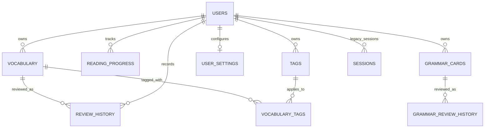

# `users.db`

## File

- Runtime: `../reader/data/users.db`

## Role

Local read-write learner state for the reader application.

Stores:

- local user identity and onboarding/streak metadata
- vocabulary deck and review history
- reading progress
- tags
- SRS settings
- grammar cards and grammar review history
- schema migration history

## Mutability and lifecycle

`users.db` is the only mutable runtime database. Back it up before schema work. Schema changes must be additive and migration-safe.

Observed runtime settings/checks:

- WAL mode enabled.
- `integrity_check`: `ok`.
- `PRAGMA foreign_keys`: observed `0`; declared FKs may not be enforced unless code/DSN enables them.

## Row counts

Observed in `../reader/data/users.db`:

| Table | Rows |
|---|---:|
| `users` | 2 |
| `sessions` | 0 |
| `vocabulary` | 62 |
| `review_history` | 11 |
| `reading_progress` | 3 |
| `tags` | 0 |
| `vocabulary_tags` | 50 |
| `user_settings` | 0 |
| `grammar_cards` | 0 |
| `grammar_review_history` | 0 |
| `schema_migrations` | 2 |

## ERD

## Tables

### `users`

Local user/streak/onboarding metadata. Historical local DBs may retain hosted-service compatibility columns.

| Column | Type | Key | Notes |
|---|---|---|---|
| `id` | INTEGER | PK | Autoincrement user id. |
| `email` | TEXT | UNIQUE NOT NULL | Local user is usually `local@lyceum.invalid`; may contain historical real emails. |
| `password_hash` | TEXT | NOT NULL | Historical/local compatibility; observed empty in current local records. |
| `created_at` | DATETIME | default CURRENT_TIMESTAMP | Created timestamp. |
| `current_streak` | INTEGER | default 0 | Current review streak. |
| `longest_streak` | INTEGER | default 0 | Longest streak. |
| `last_review_date` | DATE |  | Last review date. |
| `plan` | TEXT | default `free` | Retained compatibility/community plan marker. |
| `onboarding_step` | INTEGER | default 0 | Local onboarding progress. |
| `stripe_customer_id` | TEXT | historical | Hosted-era compatibility column. |
| `subscription_status` | TEXT | historical default `none` | Hosted-era compatibility column. |
| `subscription_end_date` | DATETIME | historical | Hosted-era compatibility column. |
| `google_id` | TEXT | historical | Hosted-era compatibility column. |
| `auth_provider` | TEXT | historical default `email` | Hosted-era compatibility column. |
| `plan_interval` | TEXT | historical default empty | Hosted-era compatibility column. |

### `sessions`

Historical session table. Current local-first reader no longer depends on hosted signup/session cookies.

| Column | Type | Key | Notes |
|---|---|---|---|
| `token` | TEXT | PK | Session token. |
| `user_id` | INTEGER | FK `users.id` | Owner. |
| `expires_at` | DATETIME | indexed | Expiration time. |

### `vocabulary`

SRS vocabulary cards.

| Column | Type | Key | Notes |
|---|---|---|---|
| `id` | INTEGER | PK | Autoincrement card id. |
| `user_id` | INTEGER | FK `users.id`, UNIQUE with `lemma` | Owner. |
| `lemma` | TEXT | NOT NULL | Lemma; unique per user in current schema. |
| `form` | TEXT | NOT NULL | Encountered form. |
| `gloss` | TEXT |  | Card gloss. |
| `pos` | TEXT |  | Part of speech. |
| `source_ref` | TEXT |  | Source reference. |
| `source_sentence` | TEXT |  | Source context sentence. |
| `edition_code` | TEXT |  | Source edition URN/code. |
| `ease_factor` | REAL | default 2.5 | SRS ease. |
| `interval` | INTEGER | default 0 | Review interval in days. |
| `interval_secs` | INTEGER | default 0 | Learning interval in seconds. |
| `state` | INTEGER | default 0 | 0 new, 1 learning, 2 review. |
| `learning_step` | INTEGER | default 0 | Current learning/relearning step. |
| `next_review` | DATETIME | indexed | Due time. |
| `review_count` | INTEGER | default 0 | Number of reviews. |
| `created_at` | DATETIME | default CURRENT_TIMESTAMP | Creation timestamp. |
| `suspended` | INTEGER | default 0 | Suspended flag. |
| `buried_until` | DATETIME |  | Buried until timestamp. |
| `lapses` | INTEGER | default 0 | Lapse count. |
| `morphology` | TEXT |  | Morphological parse. |
| `transliteration` | TEXT |  | Transliteration. |
| `source_translation` | TEXT |  | Translation of source sentence. |
| `correct_count` | INTEGER | default 0 | Number of successful reviews. |
| `contexts` | TEXT | default `[]` | JSON array of accumulated encounter contexts. |
| `review_context_idx` | INTEGER | default 0 | Current context rotation index. |

### `review_history`

Vocabulary review events with previous SRS state for undo/audit.

| Column | Type | Key | Notes |
|---|---|---|---|
| `id` | INTEGER | PK | Autoincrement review id. |
| `user_id` | INTEGER | FK `users.id`, indexed | Owner. |
| `vocabulary_id` | INTEGER | FK `vocabulary.id` | Reviewed card. |
| `rating` | INTEGER | NOT NULL | Review rating: 1 again, 2 hard, 3 good, 4 easy. |
| `reviewed_at` | DATETIME | default CURRENT_TIMESTAMP, indexed | Review timestamp. |
| `prev_ease_factor` | REAL |  | Previous ease. |
| `prev_interval` | INTEGER |  | Previous day interval. |
| `prev_interval_secs` | INTEGER |  | Previous learning seconds. |
| `prev_state` | INTEGER |  | Previous SRS state. |
| `prev_learning_step` | INTEGER |  | Previous learning step. |
| `prev_next_review` | DATETIME |  | Previous due time. |
| `time_ms` | INTEGER | default 0 | Answer time. |

### `reading_progress`

Per-edition reading position/cache.

| Column | Type | Key | Notes |
|---|---|---|---|
| `id` | INTEGER | PK | Autoincrement id. |
| `user_id` | INTEGER | FK `users.id`, UNIQUE with `edition_id` | Owner. |
| `edition_id` | TEXT | NOT NULL | Edition URN/code. |
| `author_id` | TEXT | NOT NULL | Author URN/code. |
| `work_id` | TEXT | NOT NULL | Work URN/code. |
| `section_ref` | TEXT |  | Last section reference. |
| `text_title` | TEXT |  | Cached display title. |
| `author_name` | TEXT |  | Cached author name. |
| `last_accessed` | DATETIME | default CURRENT_TIMESTAMP, indexed | Last access time. |

### `tags`

User-created vocabulary tags.

| Column | Type | Key | Notes |
|---|---|---|---|
| `id` | INTEGER | PK | Autoincrement tag id. |
| `user_id` | INTEGER | FK `users.id`, UNIQUE with `name` | Owner. |
| `name` | TEXT | NOT NULL | Tag name. |
| `color` | TEXT | default `#6b7280` | Display color. |
| `created_at` | DATETIME | default CURRENT_TIMESTAMP | Created timestamp. |

### `vocabulary_tags`

Many-to-many join table between vocabulary and tags.

| Column | Type | Key | Notes |
|---|---|---|---|
| `vocabulary_id` | INTEGER | PK, FK `vocabulary.id` ON DELETE CASCADE | Card. |
| `tag_id` | INTEGER | PK, FK `tags.id` ON DELETE CASCADE | Tag. |

### `user_settings`

SRS configuration per user.

| Column | Type | Key | Notes |
|---|---|---|---|
| `user_id` | INTEGER | PK, FK `users.id` | User. |
| `learning_steps` | TEXT | default `1 10` | Space-separated minutes. |
| `relearning_steps` | TEXT | default `10` | Space-separated minutes. |
| `new_cards_per_day` | INTEGER | default 0 | 0 means unlimited. |
| `graduating_interval` | INTEGER | default 1 | Days. |
| `easy_interval` | INTEGER | default 4 | Days. |
| `lapse_multiplier` | REAL | default 0.5 | Interval multiplier on lapse. |
| `max_interval` | INTEGER | default 365 | Maximum interval in days. |

### `grammar_cards`

Grammar SRS cards.

| Column | Type | Key | Notes |
|---|---|---|---|
| `id` | INTEGER | PK | Autoincrement grammar card id. |
| `user_id` | INTEGER | FK `users.id`, UNIQUE with paradigm/card/type | Owner. |
| `paradigm_id` | TEXT | NOT NULL | Grammar paradigm id. |
| `card_key` | TEXT | NOT NULL | Card key within paradigm. |
| `card_type` | TEXT | NOT NULL | Card type. |
| `ease_factor` | REAL | default 2.5 | SRS ease. |
| `interval` | INTEGER | default 0 | Review interval in days. |
| `interval_secs` | INTEGER | default 0 | Learning interval in seconds. |
| `state` | INTEGER | default 0 | SRS state. |
| `learning_step` | INTEGER | default 0 | Learning step. |
| `next_review` | DATETIME | indexed | Due time. |
| `review_count` | INTEGER | default 0 | Review count. |
| `correct_count` | INTEGER | default 0 | Correct review count. |
| `suspended` | INTEGER | default 0 | Suspended flag. |
| `buried_until` | DATETIME |  | Buried until timestamp. |
| `lapses` | INTEGER | default 0 | Lapse count. |
| `created_at` | DATETIME | default CURRENT_TIMESTAMP | Created timestamp. |

### `grammar_review_history`

Grammar card review events.

| Column | Type | Key | Notes |
|---|---|---|---|
| `id` | INTEGER | PK | Autoincrement review id. |
| `user_id` | INTEGER | FK `users.id`, indexed | Owner. |
| `grammar_card_id` | INTEGER | FK `grammar_cards.id` | Reviewed grammar card. |
| `rating` | INTEGER | NOT NULL | Review rating. |
| `time_ms` | INTEGER | default 0 | Answer time. |
| `prev_ease_factor` | REAL |  | Previous ease. |
| `prev_interval` | INTEGER |  | Previous day interval. |
| `prev_interval_secs` | INTEGER |  | Previous learning seconds. |
| `prev_state` | INTEGER |  | Previous SRS state. |
| `prev_learning_step` | INTEGER |  | Previous learning step. |
| `prev_next_review` | DATETIME |  | Previous due time. |
| `reviewed_at` | DATETIME | default CURRENT_TIMESTAMP | Review timestamp. |

### `schema_migrations`

Applied migration tracking table.

| Column | Type | Key | Notes |
|---|---|---|---|
| `version` | INTEGER | PK | Migration version. |
| `description` | TEXT | NOT NULL | Migration description. |
| `applied_at` | DATETIME | NOT NULL | Application timestamp. |

## Indexes and constraints

- `users.email` unique.
- `vocabulary(user_id, lemma)` unique and indexed.
- `vocabulary(user_id, next_review)` indexed.
- `vocabulary(user_id, created_at, id)` indexed.
- `review_history(user_id)` and `review_history(user_id, reviewed_at)` indexed.
- `reading_progress(user_id, edition_id)` unique.
- `reading_progress(user_id, last_accessed DESC)` indexed.
- `tags(user_id, name)` unique.
- `vocabulary_tags(vocabulary_id, tag_id)` primary key; individual indexes on each column.
- `grammar_cards(user_id, paradigm_id, card_key, card_type)` unique.
- `grammar_cards(user_id, next_review)` and `grammar_cards(user_id, paradigm_id)` indexed.
- `grammar_review_history(user_id, reviewed_at)` indexed.
- `sessions(expires_at)` indexed.

## Sensitive-data notes

This DB can contain local study history and potentially identifiable legacy data:

- email addresses in `users.email`
- old `google_id` / hosted auth columns in historical DBs
- vocabulary and review behavior
- reading history
- source sentences and context JSON

Do not commit `users.db`, `users.db-wal`, or `users.db-shm`.
